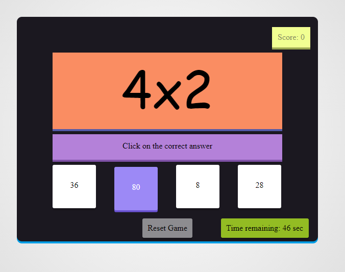
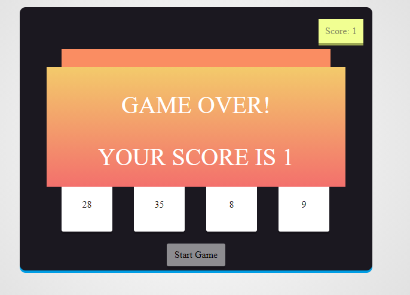

# Javascript-Multiplication-Table-Game
A game which keeps generating a multiplication problem over a timespan of 60 seconds and eventually ending up returning your score which apparently tells your brain's calculation speed! Made with HTML, CSS and Javascript!

